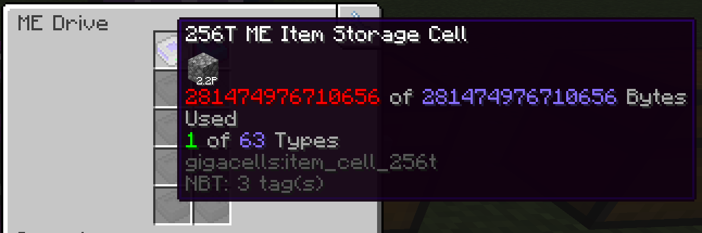

# Giga Cells

A mod for even larger [AE2] storage cells (gigabytes, terabytes) than those
provided by [MEGA Cells].

> [!Warning]
> This is extremely barebones. There are no recipes, no crafting storages,
> e.t.c. It's nothing more than storage cells, storage components, and new cell
> housings.

I made this because I wanted larger storage cells for a Monifactory run of mine.
This mod has no recipes of its own and is designed for Forge 1.20.1 exclusively.

# License

Code is licensed under LGPL-3.0, as large chunks of it are basically just
grafted from AE2 with some small modifications to support more than 2^31 bytes.

Textures are licensed under CC BY-NC-SA 3.0 and are based upon the AE2 textures
created by [Ridanisaurus].

[AE2]: https://github.com/AppliedEnergistics/Applied-Energistics-2
[MEGA Cells]: https://github.com/62832/MEGACells/
[Ridanisaurus]: https://github.com/Ridanisaurus/
